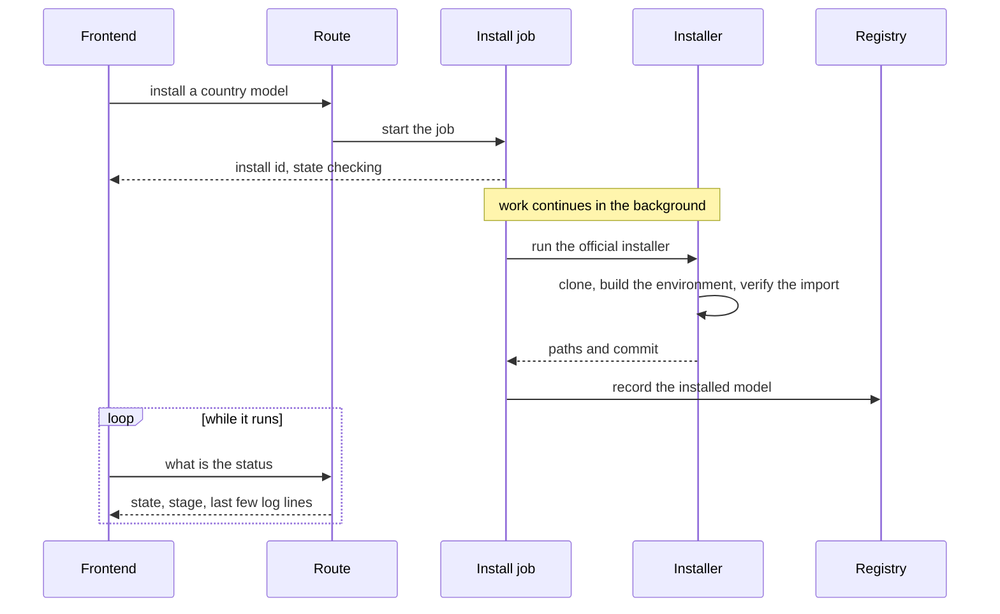
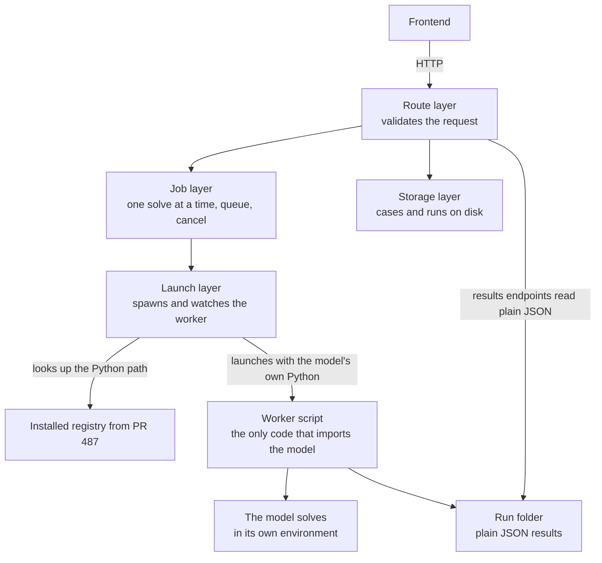
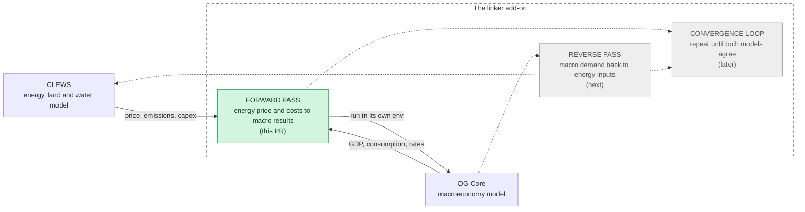
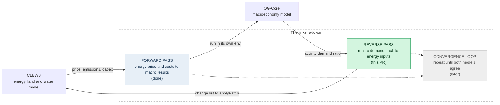

<h1 align="center">MUIOGO</h1>
<h2 align="center">The First Ever Working Bridge From A Country's Energy Plan To Its National Economy</h2>

  <b>Contributor:</b> Aditya Kushwaha &nbsp;|&nbsp;
  <a href="https://summerofcode.withgoogle.com/programs/2026/projects/l8UO1g4u">GSoC project page</a> &nbsp;|&nbsp;
  <a href="https://github.com/EAPD-DRB/MUIOGO/">EAPD-DRB/MUIOGO</a>

  
  
  
  

---

## The Engagement

MUIOGO is a web application used by governments and analysts to build and run country energy models. It already answers questions like what happens to the power system if a country builds more solar, or puts a price on carbon. What it could not answer was the question that usually follows: what does that do to the economy. Those two questions were always handled by two separate models that never spoke to each other, so anyone who wanted both answers had to move numbers between them by hand.

My work was to build the bridge. Over the summer I added the backend that installs and runs OG-Core, the macroeconomic model, inside MUIOGO, and then a coupling engine that carries results between the energy model and the economy model in both directions. An energy price change from a policy scenario now flows into the economy model and comes back as GDP, consumption, wages and interest rates. The economy's response in demand then flows back into the energy model and gets re-solved. A ministry planning an energy transition can see the electricity bill and the economic cost of the same decision in one place, from one tool, without a spreadsheet in between.

This is the first working link between these two models, and it is the piece that makes sustainable fiscal analysis possible inside MUIOGO. Until now a finance ministry could be shown a clean energy pathway but not what it would do to jobs, wages, household consumption or the tax base, which is usually the information that decides whether the pathway survives a budget meeting. Being able to answer both questions from one run is what the UN calls policy coherence, target 17.14, and it is what lets clean energy plans under SDG 7 be weighed honestly against growth and jobs under SDG 8 while still meeting climate commitments under SDG 13. The countries that need this most are the ones with the least capacity to run two modelling teams, and they now get both answers from one tool.

Mentored by : [Marcelo Lafleur](https://github.com/marcelolafleur) and  [Alfonso](https://https://github.com/autibet) 

<table width="100%">
  <tr>
    <td width="25%" align="center" valign="top">
      
    </td>
    <td width="25%" align="center" valign="top">
      
    </td>
    <td width="25%" align="center" valign="top">
      
    </td>
    <td width="25%" align="center" valign="top">
      
    </td>
  </tr>
</table>

|  | Title |
|---|---|
|  | [Add a pytest suite and a GitHub Actions pipeline](https://github.com/EAPD-DRB/MUIOGO/pull/204) |(https://github.com/EAPD-DRB/MUIOGO/pull/204) | | [Add a pytest suite and a GitHub Actions pipeline](https://github.com/EAPD-DRB/MUIOGO/pull/204) |
|   | [Widen the allowed Python versions in setup.bat](https://github.com/EAPD-DRB/MUIOGO/pull/265) |
|   | [Widen the allowed Python versions for macOS and Linux](https://github.com/EAPD-DRB/MUIOGO/pull/266) | 
|   | [OG-Core install and registry layer](https://github.com/EAPD-DRB/MUIOGO/pull/487) | 
|   | [Standalone OG-Core run pipeline](https://github.com/EAPD-DRB/MUIOGO/pull/498) |
|   | [Move OG-Core storage so it stops showing up as an energy case](https://github.com/EAPD-DRB/MUIOGO/pull/502) |
|   | [Track install jobs in the registry and harden the install lifecycle](https://github.com/EAPD-DRB/MUIOGO/pull/503) |
|  | [The coupling engine, forward pass](https://github.com/EAPD-DRB/MUIOGO/pull/537) | 
|  | [The coupling engine, reverse pass](https://github.com/EAPD-DRB/MUIOGO/pull/539) | 

### 1. Add a pytest suite and a GitHub Actions pipeline

[PR #204](https://github.com/EAPD-DRB/MUIOGO/pull/204) &middot; Merged &middot; 410 lines added across 9 files

The repository had no tests. Not a small number of tests, none, and no automated check on pull requests beyond a security scan. Everything merged so far had been merged on review alone.

This adds the testing foundation from scratch: a GitHub Actions workflow that lints with ruff and then runs pytest with coverage on every push and pull request to main, a `pyproject.toml` that holds the lint rules, test config and coverage thresholds in one place, a shared Flask test client, and 34 tests covering the HTTP behaviour of the core routes. No application code was touched. From this point on, a pull request has to pass the suite before it can merge.

Two details worth recording. Tests use `DELETE` rather than `GET` to check for wrong-method rejections, because the app serves static files from a wildcard route that swallows the 405 on GET. And the coverage floor was set deliberately low, as a number meant to be raised by every pull request that adds tests, rather than a bar nobody can clear.

### 2. Widen the allowed Python versions in setup.bat

[PR #265](https://github.com/EAPD-DRB/MUIOGO/pull/265) &middot; Merged &middot; 27 lines added

The project said it supported Python 3.10 through 3.12. The Windows setup script looked for 3.11 and quit if it did not find it. A new contributor on 3.12 hit a dead end before the real setup code ever ran, which is an unpleasant first five minutes with any project.

The script now looks for 3.12, 3.11 and 3.10 in that order, trying versioned executables first, then the `py` launcher, then plain `python` with a version check, and only fails if none of them work. Reproduced the failure on Windows 11 with Python 3.12.7, then confirmed the fix on the same machine.

### 3. Widen the allowed Python versions for macOS and Linux

[PR #266](https://github.com/EAPD-DRB/MUIOGO/pull/266) &middot; Merged &middot; 18 lines changed

The same bug lived in `setup.sh`, which hardcoded `python3.11`. Same fix, same probe order, so the two setup paths behave identically. Worth doing as its own pull request rather than folding it into the last one, since the Windows fix was already tested and this one could not be tested on the same machine.

### 4. OG-Core install and registry layer

[PR #487](https://github.com/EAPD-DRB/MUIOGO/pull/487) &middot; Merged &middot; 1,539 lines added across 9 files

This is where the real project starts. Before anyone can run an economic model for a country, that country's calibration has to be downloaded and given a working environment. This adds the backend that does it and keeps track of what is on the machine.

It brings in four pieces: a catalogue that reads the live list of available country models with a cached copy as a fallback, a registry that records what is installed and where its Python lives, an installer that drives the official OG-Core install script and verifies afterwards that the package actually imports, and a background job layer so the browser can start an install and poll for progress instead of hanging on a request that takes minutes. Eight endpoints cover catalogue listing, installing from the catalogue or from a Git URL, registering a copy already on disk, status polling, removal, and updating.

Installed models live outside the repository, under the user's home directory, each in its own isolated environment. The registry writes down the path to each environment's Python, which is what makes the next pull request possible.

Verified end to end on Windows with a real install: the job polled through to complete, the installer cloned the model and built its environment, the registry recorded the Python path and commit, and importing the package against that environment from a separate shell returned the expected version.

### 5. Standalone OG-Core run pipeline

[PR #498](https://github.com/EAPD-DRB/MUIOGO/pull/498) &middot; Merged &middot; 6,671 lines added across 24 files, 24 commits

The largest piece of the summer, and the one that took longest to get right. This is the layer that actually runs an installed country model and serves its results back, with 30 endpoints covering cases, runs, parameters, execution, results, analysis tables, tax uploads, the parameter form, and case backup and restore.

The design decision that shapes everything else: MUIOGO never imports the economic model. Every solve happens in a worker script launched inside the country's own environment, as a separate process. That worker is permanent code, not generated per run, and what changes between runs is data in the run folder. It solves the model, reads its own output files, and writes results back as plain JSON that the main application can read without knowing anything about the model internals.

How a run goes. The user makes a case tied to one installed country, creates a baseline run and then reform runs against it, and enters parameters per run. On clicking run, the request is validated and handed to the job layer, which answers the browser straight away because a solve takes a long time. The job layer checks that a reform has a finished baseline and matches its model dimensions, then claims the single execution slot, queueing anything that arrives while a solve is in progress. The launch layer looks up the right Python, starts the worker, streams its output, pulls the iteration count out for a live progress readout, and enforces a time limit. When it finishes, the frontend polls for status and reads the results.

A few behaviours are worth calling out. A run is only ever considered finished when the process exits cleanly and the worker has written a final status, never because an output file appeared. Cancelling kills the whole process tree and saves nothing. The parameter form is read live from the installed model's own defaults, so it always matches the version on that machine rather than a version assumed at build time. The solve runs on the server, not tied to the browser, so refreshing the page does not stop it, and if the server restarted mid-run the status is repaired to failed rather than left hanging.

Validation covered 12 real model solves through the full stack, both steady state and transition path, baseline and reform, plus the queue, a cancel, and a retry after cancel. Results matched a direct run of the model on the same inputs.

This replaced an earlier attempt that ran the model in the same process as MUIOGO. That approach was closed rather than fixed, because per-country version pinning makes a shared environment unworkable. Closing it was the right call and this pull request is what came out of it.

### 6. Move OG-Core storage so it stops showing up as an energy case

[PR #502](https://github.com/EAPD-DRB/MUIOGO/pull/502) &middot; Merged &middot; 10 lines changed

A small fix for a confusing bug. Once any economic model page had been opened, a folder called OGCore appeared in the energy model case picker as though it were a country model someone had made.

The cause was placement. The economic model's own state was written inside the energy model's data folder, and the case list is built by listing every folder in that directory. The first call created the folder, and from then on it was listed as a case. The fix moves that state up to the user level, next to the installed models.

Filtering the name out of the case list would have been the smaller diff, but the case list is not the only place that treats every folder there as a case, and upload and the model loader walk the same tree. Moving the folder fixes all of them at once and leaves upstream behaviour untouched. The pull request includes copy and paste commands for anyone who already had the old folder.

### 7. Track install jobs in the registry and harden the install lifecycle

[PR #503](https://github.com/EAPD-DRB/MUIOGO/pull/503) &middot; Merged &middot; 970 lines added across 11 files

Real use of the install layer turned up three gaps, and this closes all three.

Installs were only recorded once they succeeded. While one was running, or after one failed, the registry held nothing, so a failure was silent and a page reload lost track of the job entirely. A record is now written the moment an install starts and updated when it fails. A failed update over a model that is already installed and working does not knock that model back to failed, it stays installed and the error is kept alongside it.

There was also no way to stop an install. A cancel endpoint was added, along with an inactivity timeout for a clone or download that has stalled. There is no fixed overall time limit, because a healthy install can legitimately take hours and keeps logging while it does. Silence is the signal, not elapsed time. Both cancel and timeout kill the whole process tree, since the installer spawns git and the environment manager as children, and a cancelled fresh install cleans up its half finished clone while an update leaves the working copy alone.

Last, anything left mid flight when the server stopped is now reconciled on the next start, so a job from a previous session no longer reads as installing forever. Covered by 67 checks across three suites, using real subprocesses for the cancel and timeout paths, including a confirmation that a spawned grandchild process is killed along with the tree.

### 8. The coupling engine, forward pass

[PR #537](https://github.com/EAPD-DRB/MUIOGO/pull/537) &middot; Open &middot; 6,832 lines added across 40 files

This is the part the rest of the summer was building toward. It adds `oglink`, a self contained installable package that carries a solved energy scenario into the economic model. This pull request is the forward direction: energy prices in, macroeconomic results out.

Step by step, this is what it does.

1. It is pointed at a finished energy run, which has written per technology cost and production tables for a base scenario and a reform scenario.
2. It rebuilds a levelized electricity price per year from those tables and takes the reform to base ratio. Only the ratio drives the headline result, so no currency conversion is needed.
3. It finds electricity inside the economic model, which groups the economy into a handful of industries and goods. Which industry is electricity and which consumption good carries it are read from the country model's own definitions. If electricity cannot be cleanly separated, the energy channels skip rather than return a misleading number.
4. It turns the price into model inputs. Households see a higher energy price as a consumption wedge, industries see a cost increase weighted by how much electricity each one uses, and grid investment, a carbon price signal and an air quality health effect are layered on the same way.
5. It runs the economic model as a separate process, same as the run pipeline, handing over the input changes as a small file and reading the solution back as plain numbers.
6. It writes a macro table of percentage differences in GDP, consumption, capital, labour, interest rate and wage, by year and at the long run steady state, plus a manifest recording exactly what produced the run.

Seventeen unit tests cover the price reconstruction against a closed form case, the industry weighting, the electricity location logic, the wedge and macro table maths, the file boundary round trip, and the table reader that has to pick the exact table and not a similarly named neighbour. Two safety properties are locked by tests: the subprocess must not leak this package's environment into the model's environment, and a failure to compute the industry weighting has to be recorded rather than silently dropped. A slow end to end test reproduces a real country result and skips cleanly when no model is installed, so the default test run stays fast.

### 9. The coupling engine, reverse pass

[PR #539](https://github.com/EAPD-DRB/MUIOGO/pull/539) &middot; Open &middot; 7,516 lines added across 45 files

The other half of a coupling pass. The forward pass sends an energy price into the economy. This sends the economy's response back into the energy model and re solves it.

How it works.

1. It starts from a finished coupled run. The forward pass leaves behind a per year demand feedback, the reform to base ratio of economic activity.
2. It reads the case's base annual demand for the target commodity, the same rows that will later be overwritten, so the number it scales and the number that gets set are the same one.
3. It multiplies base demand by the ratio for each forecast year, targeting the household demand commodity that actually carries load, only for years from the model start onward, and skipping any year where nothing would change.
4. It writes a small change list and posts it to the existing patch endpoint. Nothing is written into the case directly.
5. That endpoint does the safe re solve: it copies the case, validates every change before writing, regenerates the data file, checks the structure did not change, solves, and returns the results folder.
6. It reports the copied case, the new run and the results path. A no-op warning from the patch endpoint is treated as a failure, since that means the base demand it read had drifted since.

Unit tests cover the change builder on known inputs, including year clipping, no-op suppression, the guard against an all zero base, and the guard against zeroing a live cell, plus the HTTP client on success, on a blocked patch, and against a server that is not running. A dry run against the bundled demo case confirms the emitted values equal base demand times the ratio with no network call, and an opt-in live test posts to a running app and checks the re solve.

One thing is deliberately left out. The economy's equilibrium interest rate is a region level parameter, and the patch endpoint's change model works on single entity year tables, so it cannot express that. It is recorded as a deferred note for the convergence stage rather than forced through in a shape that does not fit.

---

## What is left

The forward and reverse passes each do one direction of one pass. The convergence loop, which repeats the exchange until both models agree on a single answer, is the next stage and builds directly on what is here. The deferred interest rate channel belongs to that stage too.

---

## Thanks

Thanks to my mentors for the reviews, for the design conversations that changed the shape of this work more than once, and for pushing back on the version of the architecture that would not have held up. Thanks to UN DESA and UN OICT for taking on a contributor and letting the work reach real users, and to Google Summer of Code for the time and space to do it properly.

---

  <a href="https://github.com/Adityakushwaha2006">GitHub</a> &middot;
  <a href="https://summerofcode.withgoogle.com/programs/2026/projects/l8UO1g4u">GSoC 2026 project</a> &middot;
  <a href="https://github.com/EAPD-DRB/MUIOGO/">MUIOGO</a>

